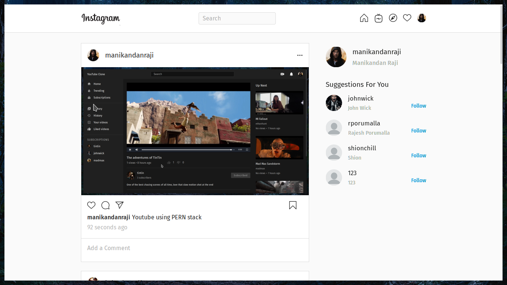

# Instaclone Frontend

Instagram clone using MERN stack. This is the frontend repo built with Reactjs. If you are looking for the backend repo, [click here](https://github.com/manikandanraji/instaclone-backend)

[Check out the deployed site](https://instaclone2.netlify.app)

## Packages used
1. React Router (for routing)
2. Styled Components (for styling)
3. React Toastify (for toast-notifications)

Global state management is taken care of by React Context API. For image uploads, instaclone uses Cloudinary. 

## Running Locally

At the root of the project, you should have a .env with the following contents

```js
REACT_APP_BACKEND_URL=<your_backend_url>
REACT_APP_CLOUDINARY_URL=https://api.cloudinary.com/v1_1/<cloud_name>/upload
```

Then run <code>npm i && npm run start</code> to see the instaclone in action

## How it looks

### Home 


### Explore


### Detailed Post


### Profile


### Edit Profile


### New Post


## Twitter clone
I also built a twitter clone using Prisma + GraphQL. You can take a look, if you interested.

1. [Twitter Clone Frontend](https://github.com/manikandanraji/twitter-clone-frontend)
2. [Twitter Clone Backend](https://github.com/manikandanraji/twitter-clone-backend)
